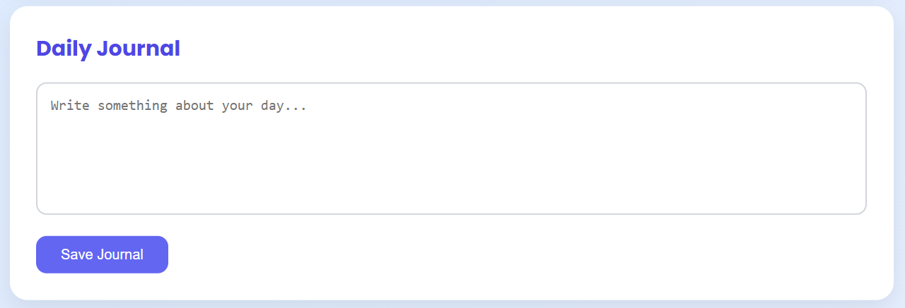
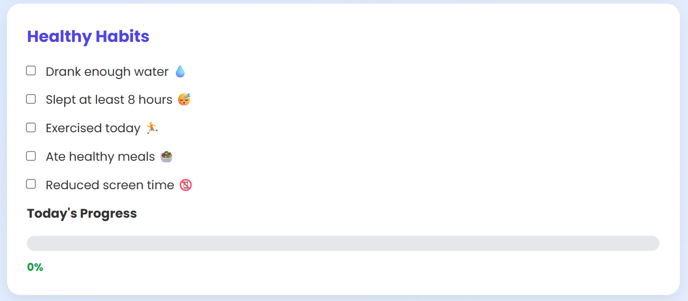

# MindBalance

MindBalance is a web application inspired by the HBSC (Health Behaviour in School-aged Children) study.

## Screenshots 

### Mood Tracker

### Daily Journal

### Healthy Habits

## Features

- Mood Tracker
- Daily Journal
- Healthy Habits Checklist
- Water Tracker
- Wellness Tips
- Daily Quotes
- Weekly Mood Chart
- Progress Tracker
- Dark Mode

## Technologies

- HTML
- CSS
- JavaScript
- Chart.js
- LocalStorage

## Getting Started

1. Clone this repository.
2. Open `index.html` in your broswer.

## Purpose

The application encourages adolescents to build healthy habits, monitor their emotions and improve their overall well-being.